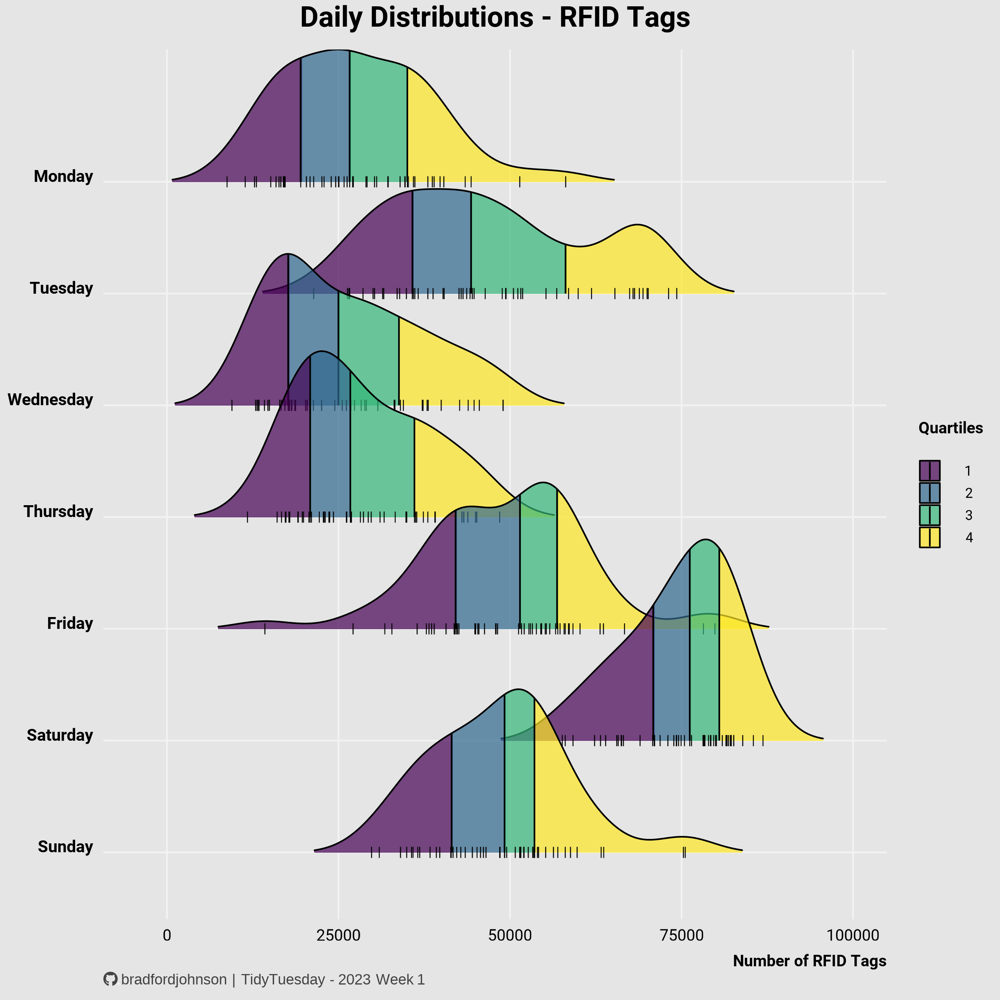
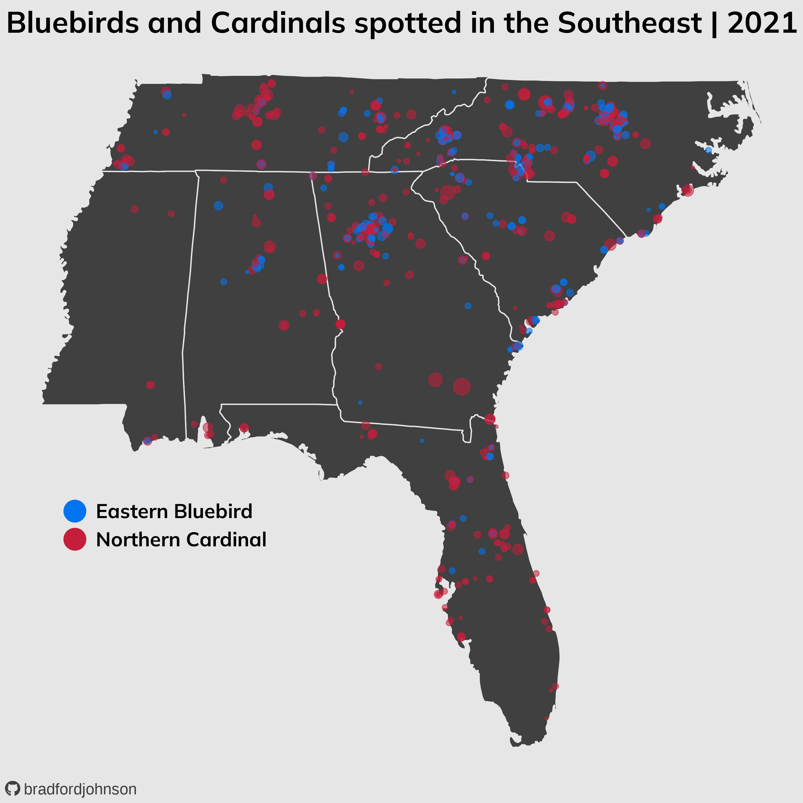
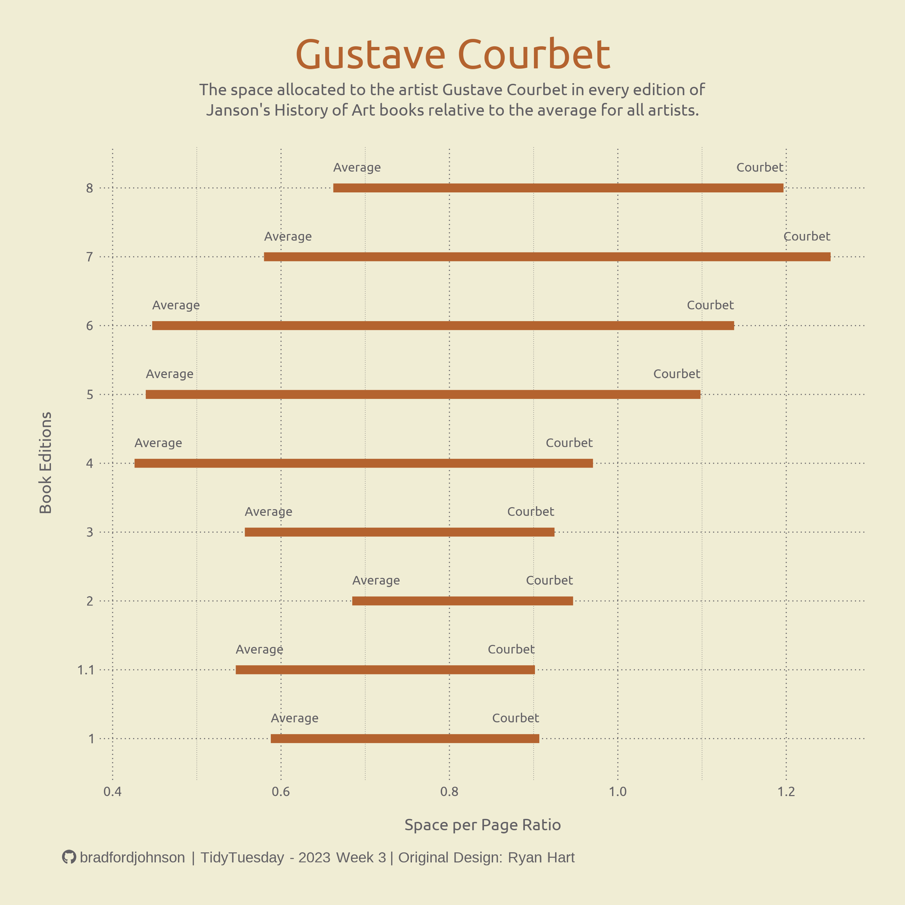
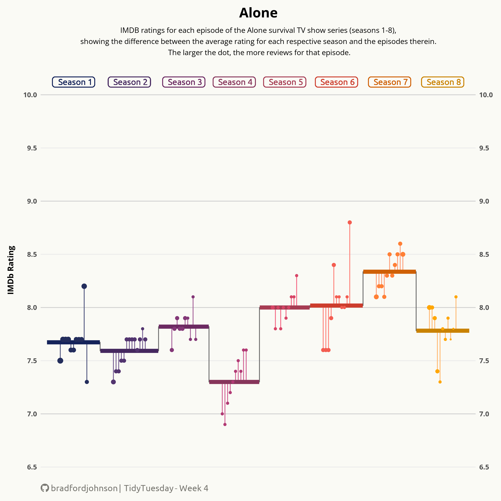
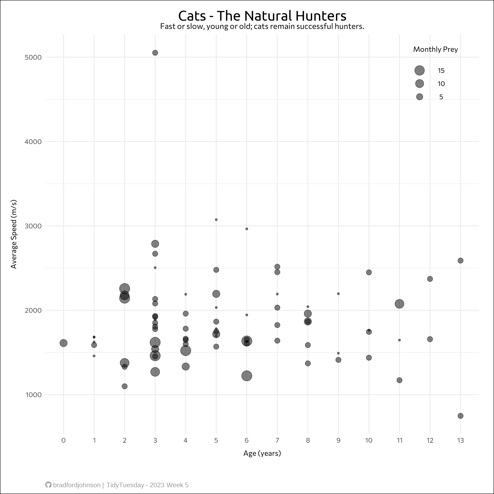
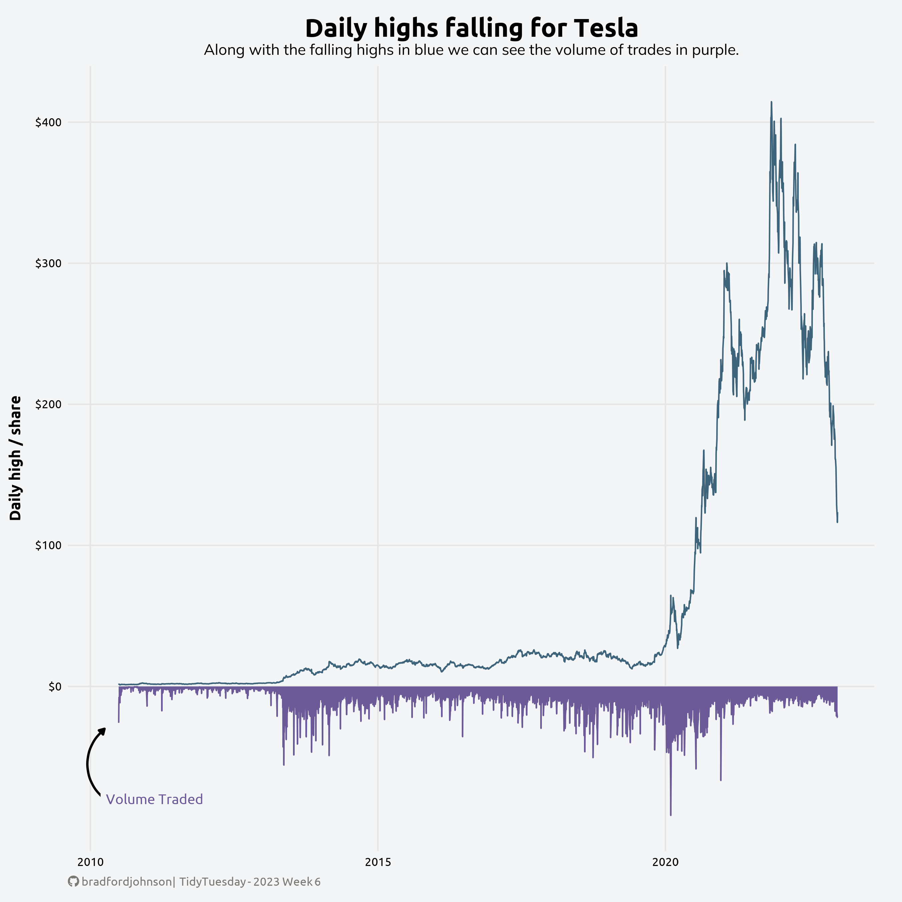
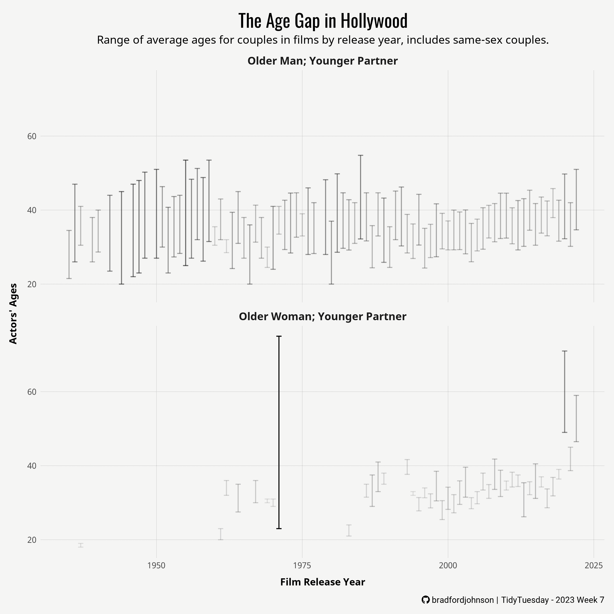
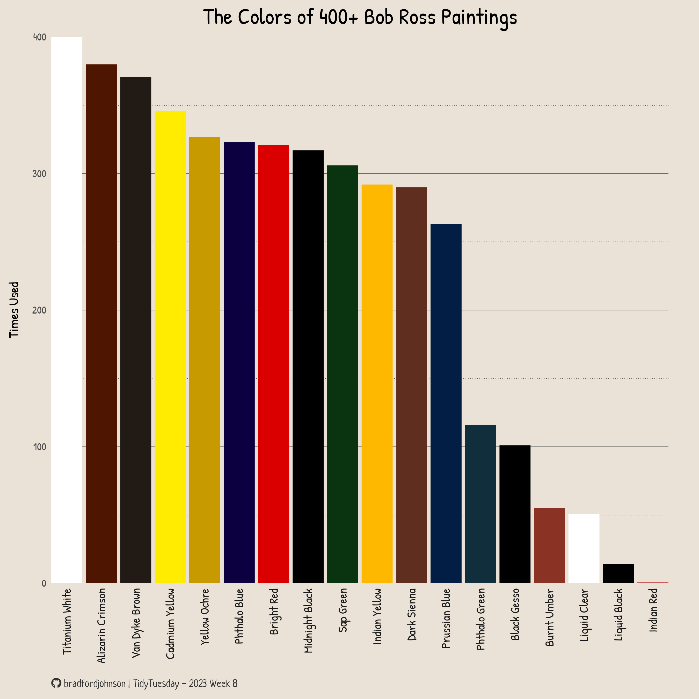

**Week 1** | `Bring your own data:` RFID Tags
---

  

**Week 2** | `Bird FeederWatch data:` [Data Source](https://feederwatch.org/explore/raw-dataset-requests/) 
---

  

**Week 3** | `Art History data:` [Data Source](https://saralemus7.github.io/arthistory/) 
---

  

**Week 4** | `Alone TV Series data:` [Data Source](https://gradientdescending.com/alone-r-package-datasets-from-the-survival-tv-series/) 
---

  

**Week 5** | `Pet Cats UK data:` [Data Source](https://www.datarepository.movebank.org/handle/10255/move.882/) 
---

  
    
**Week 6** | `Tech Stocks data:` [Data Source](https://github.com/rfordatascience/tidytuesday/tree/master/data/2023/2023-02-07) 
---

  

 **Week 7** | `Hollywood age gap data:` [Data Source](https://hollywoodagegap.com/)
---

  

 **Week 8** | `Bob Ross Paintings Data data:` [Data Source](https://github.com/jwilber/Bob_Ross_Paintings/blob/master/data/bob_ross_paintings.csv)
---

  
