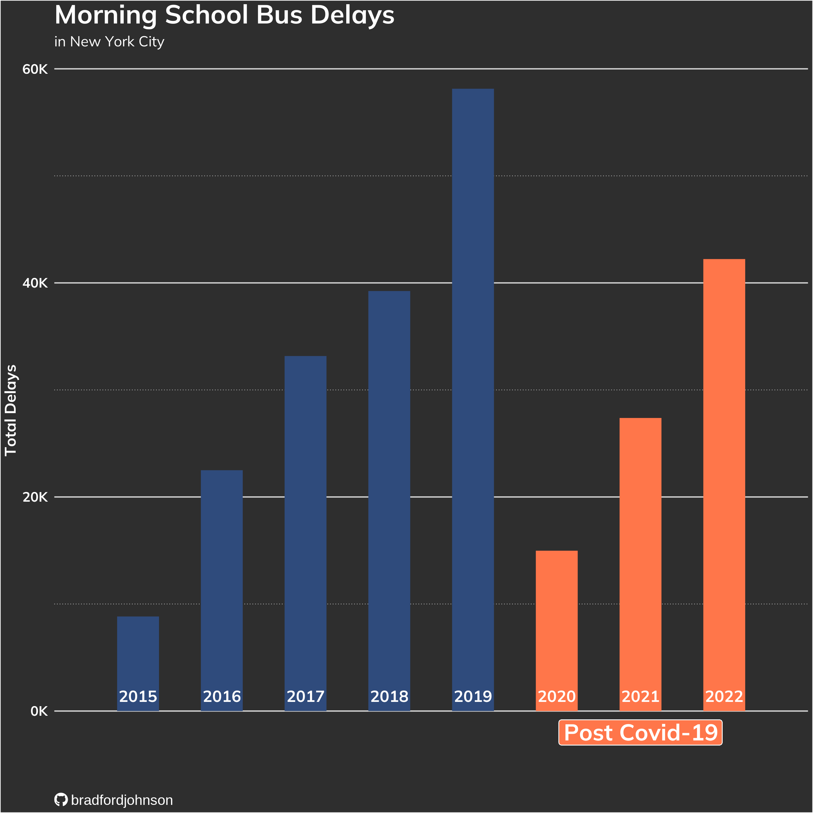

  
**Week 1** | `Bring your own data:` [Data Source](https://www.kaggle.com/datasets/mattop/new-york-city-bus-breakdown-and-delays) 
---

  
    
**Week 2** | `Bird Feeder Counts:` [Data Source](https://feederwatch.org/explore/raw-dataset-requests/)
---
